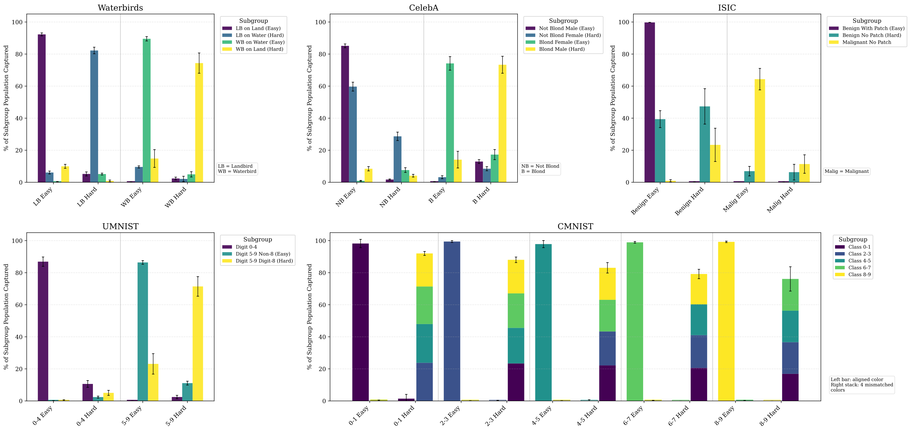
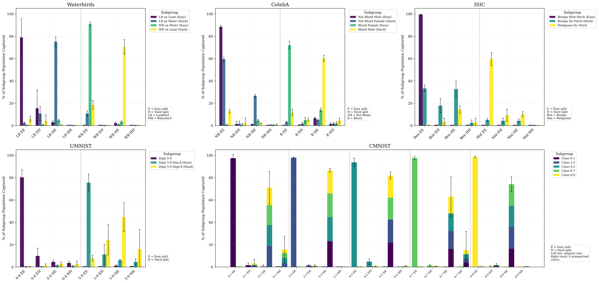

<!-- TODO: replace the placeholder "#" Paper link below with the arXiv abstract URL once it is live -->
::: {.callout-note appearance="simple"}
This post accompanies our paper *Discovering Latent Groups for Robust Classification* (with Ulrich Aïvodji, Samira Ebrahimi Kahou, and Vincent Michalski).
[📄 Paper (arXiv coming soon)](#) · [💻 Code](https://github.com/agarg-dev/Neural-Classification-Trees)
:::

## The shortcut problem, and the part nobody shows you

Deep networks love a shortcut. Train an image classifier to tell waterbirds from landbirds and, if almost every waterbird in your data sits on water, the model will quietly learn to read the *background* instead of the bird. Average accuracy looks great. Then a waterbird shows up in front of a forest and the model confidently calls it a landbird. This is the classic story of *spurious correlations*, and the failures land hardest on the underrepresented subgroups: the waterbird on land, the blond man, the lesion without the tell-tale marker.

The research community has built effective tools to mitigate this. Group DRO upweights the worst group, JTT retrains on the errors of an early-stopped model, GEORGE clusters features into pseudo-subgroups, and so on. They work. But they share a blind spot of their own: after all that effort, the final classifier is still opaque about the groups it learned. Ask it which latent subgroup a particular image belongs to, and it has nothing to say. The robustness lives in the parameters; the *structure* stays invisible.

That is the gap we set out to close.

## The idea: make the partition the architecture

Most methods treat training difficulty as a *transient* signal: find the hard samples, upweight them, then throw the partition away. Our bet is that the partition is the interesting part, and it should survive.

**Neural Classification Trees (NCT)** turn difficulty into a tree-shaped architecture. The construction is simple and self-supervised:

1. Train the model for a short burst. Some samples get classified correctly (the *easy* ones), some do not (the *hard* ones).
2. Split each node into two children accordingly: an easy branch for the samples it got right, a hard branch for the ones it got wrong.
3. Reuse those routes as the labels for the next iteration, and repeat.

No subgroup annotations are ever required. The signal driving the whole tree is just correctness. Concretely, with a binary difficulty indicator $d^{(t)}_i$ that is 1 when sample $i$ is misclassified at iteration $t$, the node assignment updates as

$$
\ell^{(t+1)}_i = 2\,\ell^{(t)}_i + d^{(t)}_i,
$$

so every parent node $j$ splits into an easy child $2j$ and a hard child $2j+1$. After $T$ iterations, the binary string of easy/hard decisions along the route to a leaf is a compact record of how difficult that sample was to learn. Crucially, this tree is not scaffolding that gets discarded: it *is* the inference-time model. Each leaf reports both a predicted class and the difficulty path that produced it.

{width=85% fig-align="center"}

## How the tree grows

A few design choices turned out to matter more than we expected.

**Routing by correctness.** The split is deterministic and driven entirely by training dynamics: correctly classified samples flow to the easy child, misclassified ones to the hard child. There is no clustering step and no threshold to tune.

**Asymmetric head capacity.** The two children of a split are not built the same way. Easy children, which inherit samples the parent already handles, are a single linear layer. Hard children, which absorb the conflicting cases, get a richer Linear-ReLU-Dropout block. The extra capacity belongs where the difficult features live, and our ablations confirm that putting it on the easy branch instead consistently underperforms.

**Hierarchical feature flow.** Deeper heads do not see raw backbone features; they receive their parent's representation. Specialization therefore compounds down the tree rather than starting over at every level.

**Stability.** Training a hierarchy iteratively risks catastrophic forgetting, where adapting the children destabilizes the parents they depend on. We counter this with an auxiliary loss that keeps the parent representations valid, plus a two-phase schedule: first adapt the new heads with the backbone frozen, then fine-tune the whole network so it can resolve cases that were previously inseparable.

**Knowing when to stop.** A correctness-based tree grows multiplicatively, but not every dataset wants a deep one. NCT decides its own depth without group labels using a pseudo worst-group accuracy criterion with a Wilson-tolerance stopping bound, and folds away hard children that end up with too few samples to be worth a head.

## Why difficulty is a good compass

Two pieces of theory motivate the design.

**Misclassified samples are enriched with minorities.** Neural networks tend to learn the simple, prominent feature first (this is the well-documented *simplicity bias*). When a spurious correlation is strong, that easy feature is the spurious one, so after the first short training burst the model is mostly predicting the spurious attribute rather than the true label. The samples it gets *wrong* are therefore disproportionately the minority cases where the attribute and label disagree, and the stronger the spurious correlation, the more lopsided that error set becomes. Routing those errors into the hard branch is what concentrates the minority subgroup there.

**One classifier cannot serve two conflicting subgroups.** When the easy and hard subgroups need genuinely different features (the majority is best classified by the background, the minority only by the bird), no single linear classifier is optimal on both at once. We make this precise as an approximation gap: any shared classifier pays a worst-group penalty that a pair of specialists avoids, and that penalty widens as the spurious correlation gets stronger. NCT's separate heads are exactly the specialists that close it.

## Does it actually work?

We evaluate on five spurious-correlation benchmarks (Waterbirds, CelebA, ISIC skin lesions, Undersampled MNIST, and a 5-class Colored MNIST) against eight baselines spanning three supervision tiers, from fully group-supervised down to fully unsupervised.

The headline is that NCT delivers worst-group accuracy competitive with the strongest baselines while sitting in the *unsupervised* tier, using no group labels at training or validation time, and it is the only method in the comparison whose inference-time architecture exposes the discovered partition. On ISIC it actually leads every supervision tier on AUROC despite using no group labels at all. You no longer have to choose between a robust model and a legible one.

## What the tree actually learns

A method that improves worst-group accuracy is useful; a method that *shows you why* is the goal. NCT's partition is explicit, so we can simply look at it.

The cleanest view is the iteration-2 capture rate: for each ground-truth subgroup, what fraction of it lands in each leaf. Across every dataset, the same pattern emerges without any supervision: majority subgroups pile into the easy leaves, minority subgroups into the hard leaves.

{fig-align="center"}

The hard landbird leaf on Waterbirds catches 82% of the minority landbird-on-water; the hard benign leaf on ISIC isolates 47% of the no-patch lesions, forcing the model off the color-patch shortcut and onto the lesion itself; the hard digit leaf on UMNIST captures 71% of the undersampled digit 8; the blond-male minority on CelebA concentrates at 73% in its hard leaf. The tree is sorting samples by exactly the axis we care about, and it discovered that axis on its own.

But do the easy and hard heads really rely on *different* features, or do they just happen to separate the samples? We answer this with attribution maps. The picture is striking: easy leaves lock onto the spurious cue, and hard leaves shift to the genuine class signal.

{fig-align="center"}

On Waterbirds the easy waterbird head attends to the water and the wake behind the bird; the hard head localizes tightly on the bird's body across both water and forest. On ISIC the easy benign head fixates on the colored marker ring that frames many benign training images, while the hard head centers on the lesion's boundary and ignores the artifact. On CelebA the easy blond head reads the lower face as a gender proxy, and the hard head moves up to the hair, the actual signal, including cases where a cap occludes it. This is the mechanistic evidence that the structural split is meaningful, not cosmetic.

## Going one level deeper

Push the tree to a third iteration and the story holds at finer granularity. Each iteration-2 leaf splits again, and the minority subgroups keep concentrating in the hard branch of their own class rather than leaking into the wrong one.

{fig-align="center"}

The depth that is actually best is dataset-dependent (and sometimes even seed-dependent), which is why NCT selects it per run from its own validation proxy instead of fixing it ahead of time.

## Limitations and what is next

Two honest conditions come with the structural guarantees. First, the routing leans on simplicity bias: if the minority features are themselves easy to learn, difficulty stops being a clean proxy for subgroup identity and the isolation degrades. This is exactly what we see on Undersampled MNIST, the one benchmark where plain training already classifies many minority samples correctly. Second, the unsupervised depth selection rests on a pseudo worst-group accuracy that tracks the true metric well but not perfectly, and can stop early when the proxy collapses faster than reality. Severe class imbalance can amplify both effects.

Longer term, I am most excited about two directions. One is taking NCT to language, where spurious correlations come from lexical artifacts and demographic markers rather than localizable image regions, to test whether simplicity bias gives the same routing signal under a different feature geometry. The other is enriching the routing rule itself: correctness is the simplest possible difficulty signal, and gradient-based, attribution-based, or representation-disagreement criteria could partition data along axes that correctness alone misses.

The broader claim we are making is that the latent group structure of a dataset does not have to stay hidden in the weights. It can be recovered as the architecture itself, discovered without supervision and visible at inference.

## Try it

The code, training scripts, and dataset setup are on [GitHub](https://github.com/agarg-dev/Neural-Classification-Trees):

```bash
git clone https://github.com/agarg-dev/Neural-Classification-Trees.git
```

The pipeline covers all five benchmarks (Waterbirds, CelebA, ISIC, UMNIST, CMNIST) with the two-phase training, unsupervised depth selection, and per-leaf capture-rate and attribution diagnostics used in the paper.

## Citation

```bibtex
@article{garg2026nct,
  title   = {Discovering Latent Groups for Robust Classification},
  author  = {Garg, Ankur and A{\"i}vodji, Ulrich and Ebrahimi Kahou, Samira and Michalski, Vincent},
  journal = {arXiv preprint arXiv:XXXX.XXXXX},
  year    = {2026}
}
```
